# SUKRIT CHAKRAVARTY
Second-year Computer Science Engineering student specializing in AI/ML.

I am a developer focused on artificial intelligence, machine learning, and building practical software. I enjoy learning by creating things from scratch, turning ideas into functional code, and solving complex problems. My current trajectory is geared towards becoming a strong, job-ready developer by the end of my 3rd year.

 

### CURRENTLY BUILDING
* AI/ML experiments and models
* Interactive web applications using React
* Solidifying core Computer Science fundamentals

### TECH STACK
**Languages:** Python · C++ · JavaScript · SQL · HTML/CSS  
**Frontend:** React · Tailwind CSS  
**AI / ML:** PyTorch · TensorFlow · NumPy · Pandas · Scikit-learn  
**Tools:** Git · GitHub · VS Code  

### CONTRIBUTIONS

  <code>CONTRIBUTION STREAK → MOVING FORWARD</code>

### CURRENT GOALS
→ Build real projects  
→ Improve DSA  
→ Get stronger at AI/ML  
